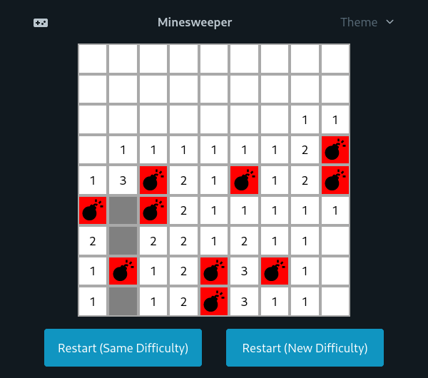

# Minesweeper

A minimal Minesweeper clone written for desktop browsers using Svelte and picoCSS.

## Install

This repo uses [pnpm](https://pnpm.io/) as its package manager. With `pnpm`
installed, run `pnpm install` to install the project's dependencies.

## Usage

Run `pnpm run dev` to start a local development server. Run `pnpm run build` to
build the project, and serve the resulting `dist` server as a website.

The rules are the same as typical Minesweeper. Left click to unveil squares,
right click to flag uncovered squares, and you can left click on an uncovered
square to chord if you've flagged all the squares you believe to be mines
around it.

## Thanks
- [PicoCSS](https://picocss.com/) for a great and simple CSS framework, as
  well as code for changing the theme.

## Contributing
I'm open to any PRs to add or improve features!

## License
MIT